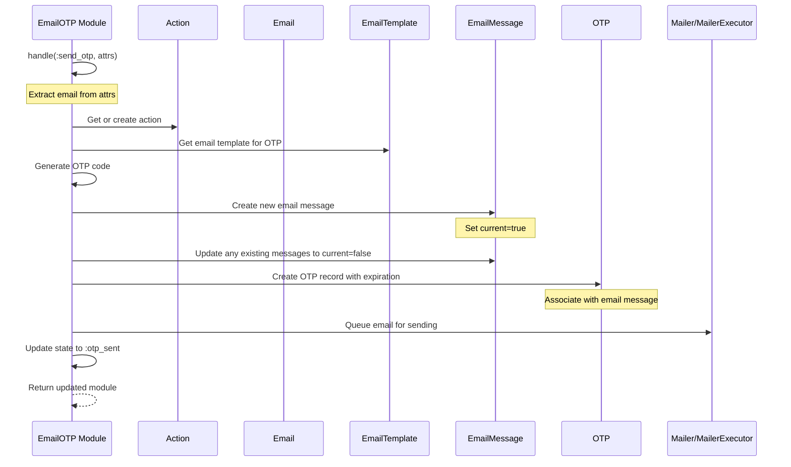

# Email OTP Sending Flow Implementation Plan

## Overview

The Email OTP (One-Time Password) flow is a security mechanism that allows users to authenticate by receiving a time-limited code via email. The implementation will focus on the state machine logic in the `handle(%__MODULE__{} = mod, :send_otp, attrs)` method of the `Passwordless.Challenges.EmailOTP` module.

## System Components

From my analysis, I've identified the following key components involved in the Email OTP flow:

1. **EmailOTP State Machine** (`lib/passwordless/flows/email_otp.ex`): Manages the state transitions for the OTP flow.
2. **Action** (`lib/passwordless/action.ex`): Represents an actor event with a specific flow type (email_otp).
3. **EmailMessage** (`lib/passwordless/email_message.ex`): Represents an email message with content and metadata.
4. **OTP** (`lib/passwordless/otp.ex`): Represents a one-time password with code, expiration, and attempts.
5. **Email** (`lib/passwordless/email.ex`): Represents an email address associated with an actor.
6. **EmailTemplate/EmailTemplateVersion** (`lib/passwordless/email_template.ex`, `lib/passwordless/email_template_version.ex`): Provides templates for email content.
7. **Mailer/MailerExecutor** (`lib/passwordless/mailer.ex`, `lib/passwordless/mailer_executor.ex`): Handles the actual sending of emails.

## State Machine Flow

The state machine for Email OTP has the following states:

- `started`: Initial state
- `otp_sent`: OTP has been sent to the user
- `otp_valid`: OTP has been validated successfully
- `otp_invalid`: OTP validation failed
- `otp_exhausted`: Maximum number of attempts reached

The transitions we need to implement are:

- `started` → `otp_sent`: When sending an OTP for the first time
- `otp_sent` → `otp_sent`: When resending an OTP

## Implementation Plan for `handle` Method

The `handle(%__MODULE__{} = mod, :send_otp, attrs)` method needs to implement the following business logic:

1. Generate an OTP code
2. Generate an email message with the OTP included
3. Queue the email message for sending
4. Perform database operations for consistency

Here's the detailed implementation plan:

## Database Operations

The following database operations will be performed:

1. **Create or update Action**: Ensure an action exists for this flow
2. **Create EmailMessage**: Create a new email message with the OTP content
3. **Update existing EmailMessages**: Set `current=false` for any existing email messages for this action
4. **Create OTP**: Create a new OTP record associated with the email message
5. **Update EmailOTP state**: Update the state of the EmailOTP to `otp_sent`

## Implementation Details

### 1. Generate an OTP

We'll use the `Util.random_numeric_string/1` function to generate a 6-digit OTP code.

### 2. Generate an Email Message

We'll create a new `EmailMessage` with:

- The OTP code included in the content
- Associated with the action and email
- Marked as `current=true`
- Content derived from the appropriate email template

### 3. Queue the Email Message for Sending

We'll use the `MailerExecutor` to queue the email for sending via Oban.

### 4. Database Operations

All database operations will be performed within the transaction that wraps the `handle` method call.

## Error Handling

The implementation will include proper error handling for:

- Missing or invalid email
- Template rendering failures
- Database operation failures

## Testing Considerations

The implementation should be testable with:

- Unit tests for the `handle` method
- Integration tests for the full flow
- Tests for error conditions

## Implementation Timeline

1. Implement the `handle` method
2. Test the implementation
3. Document the implementation
4. Deploy the implementation

## Conclusion

This implementation plan provides a comprehensive approach to implementing the Email OTP sending flow. The implementation will follow the existing patterns in the codebase and integrate with the existing components.
